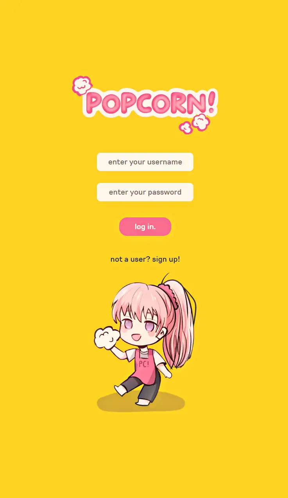
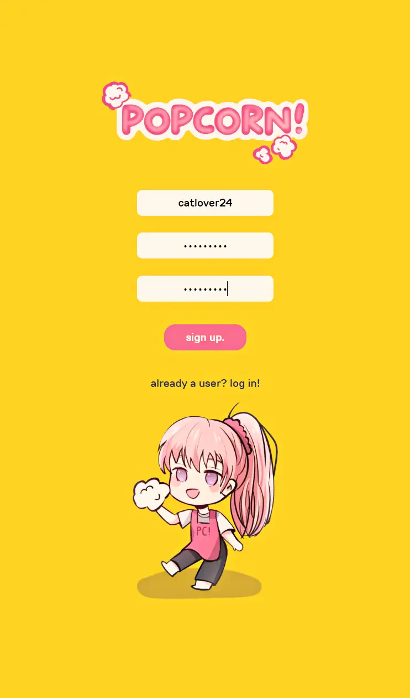
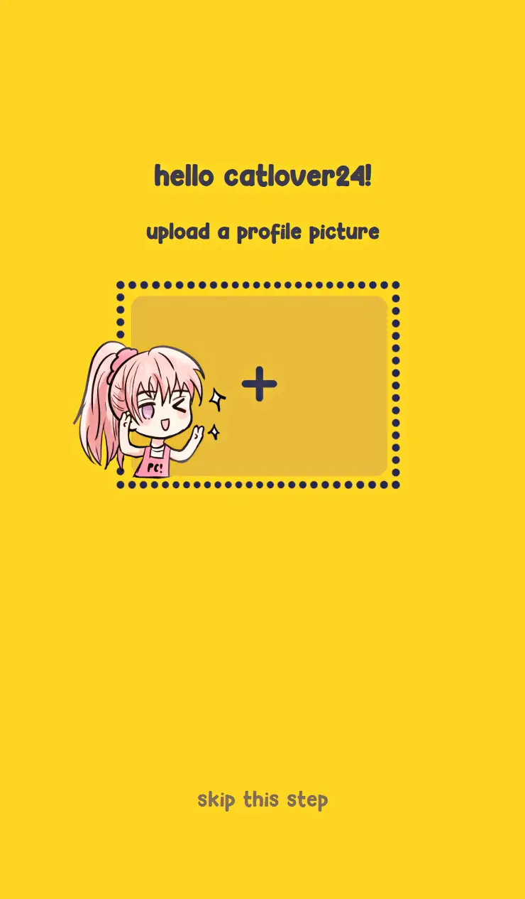
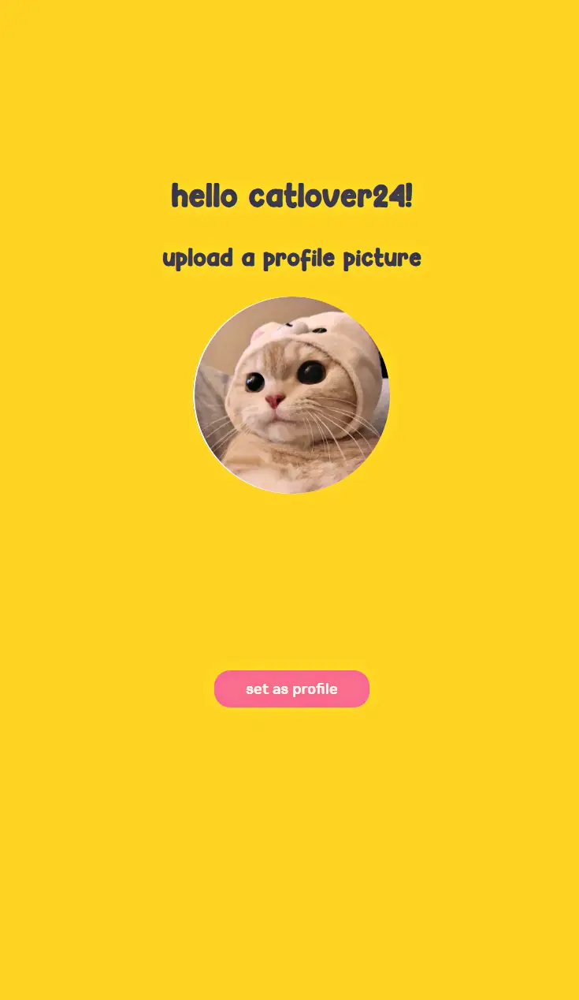
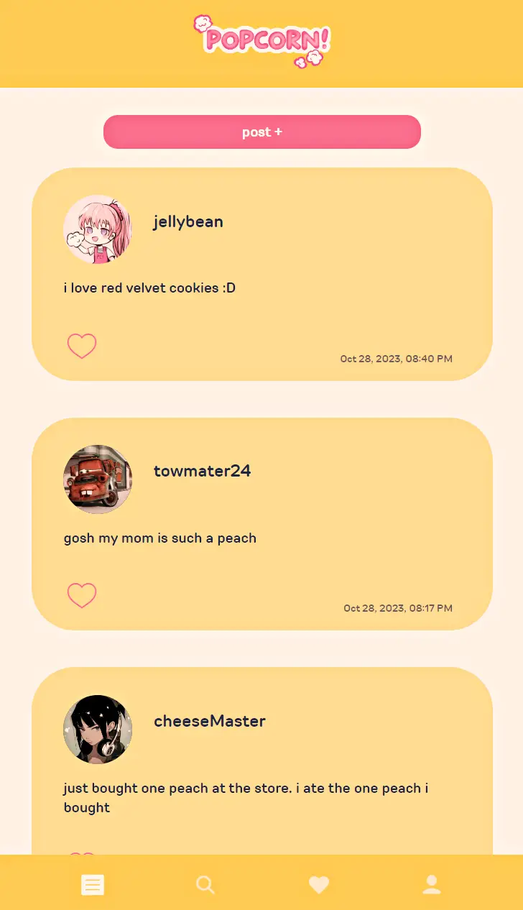
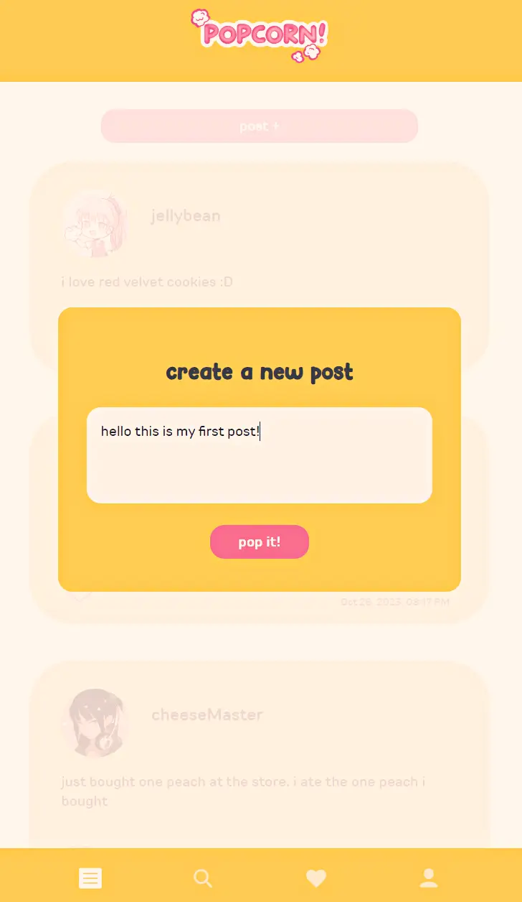
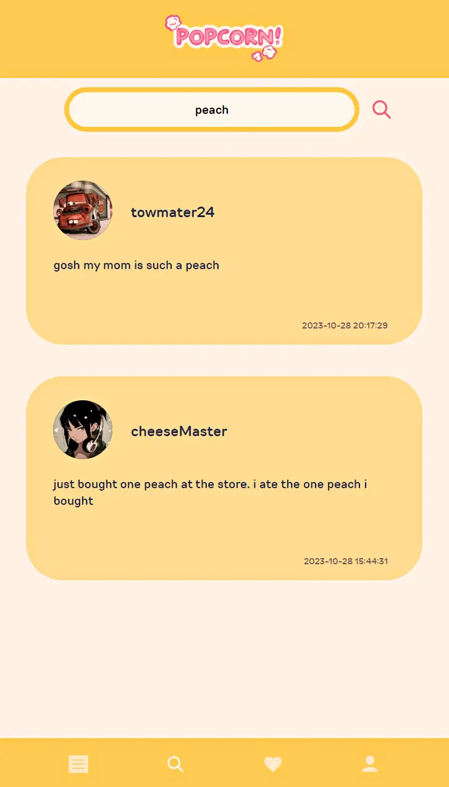
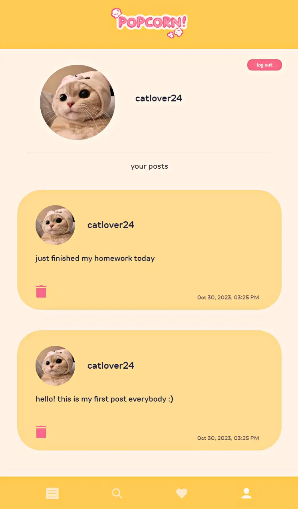
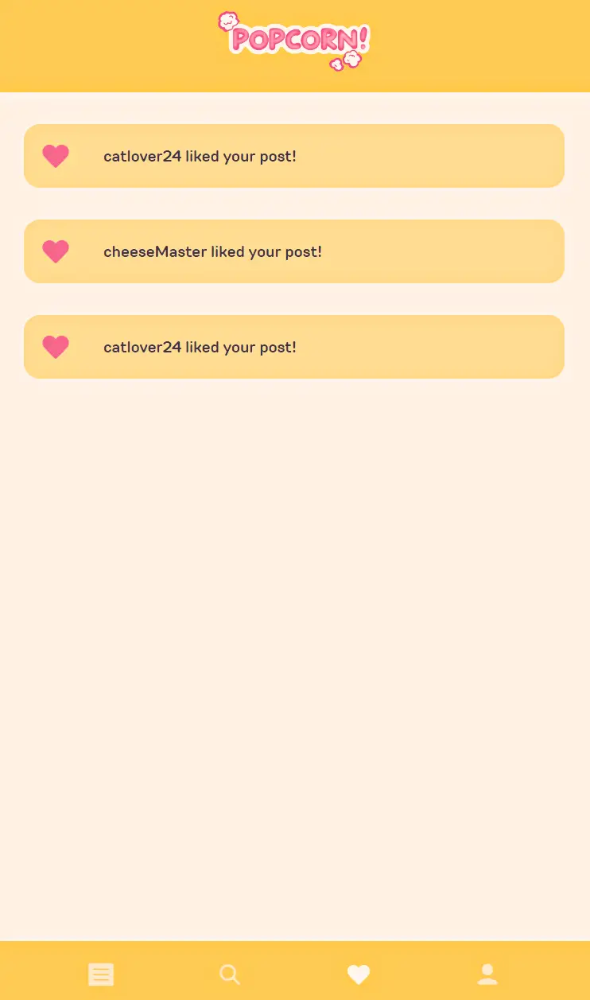

# popcorn

A text based social media platform.

 

### ☆ ───── Technologies ───── ☆

 
☆ HTML  
☆ CSS  
☆ Javascript  
☆ PHP  
☆ mySQL  
 

### ☆ ───── Features ───── ☆

  
☆ Login and account creation page  
☆ Create and delete text-based posts  
☆ Image upload for profile picture  
☆ Like post feature  
☆ Search engine for post content  
☆ Notifications tab  
☆ User profile page to view all of your posts and/or delete them  
☆ Custom art  

  
 
### ☆ ───── Screenshots ───── ☆

  
 

    
    
    
    
    
    
    
    
    

  
 
### ☆ ───── Future enhancements ───── ☆

  
☆ Follow feature  
☆ Profile bio  

